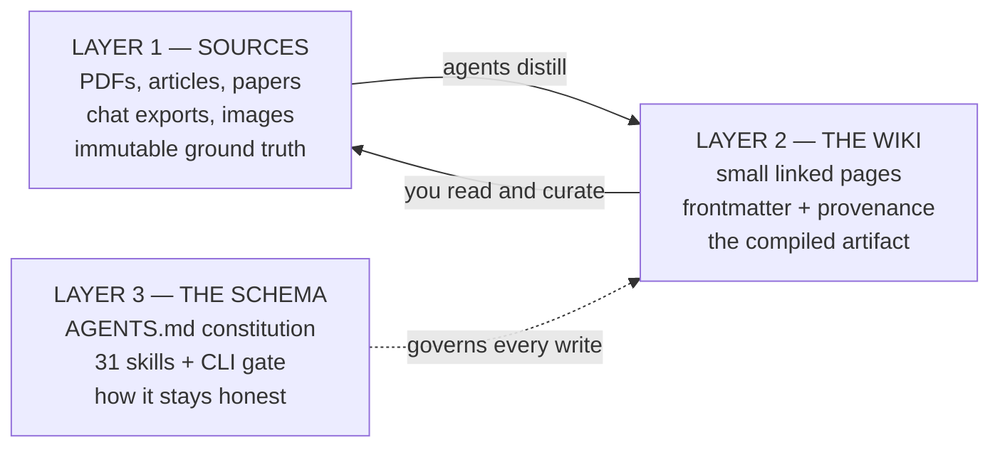

<a id="readme-top"></a>

<div align="center">

# llm-wiki

**Your notes, compiled.**

A knowledge base your AI agents maintain under written law — not a chatbot, not a vector store.
31 agent skills, a zero-dependency CLI, and a ready-to-copy Obsidian vault governed by a constitution.

[![MIT License][license-shield]][license-url]
[![Python 3.10+][python-shield]][python-url]
[![Zero dependencies][deps-shield]][deps-url]
[![Skills][skills-shield]][skills-url]
[![Stargazers][stars-shield]][stars-url]
[![Issues][issues-shield]][issues-url]

[**Project site**][site-url] ·
[Quickstart](#getting-started) ·
[The Constitution](#the-constitution) ·
[Skills](#the-skills) ·
[CLI](#cli-reference) ·
[Report Bug][issues-url] ·
[Request Feature][issues-url]

</div>

<details>
  <summary><b>Table of Contents</b></summary>

1. [About The Project](#about-the-project)
   - [How it works](#how-it-works)
   - [The graph weaves itself](#the-graph-weaves-itself)
   - [Compared to RAG](#compared-to-rag)
   - [Built With](#built-with)
2. [Getting Started](#getting-started)
   - [Prerequisites](#prerequisites)
   - [Installation](#installation)
   - [Scaffold a new vault](#scaffold-a-new-vault)
3. [Usage](#usage)
   - [The loop](#the-loop)
   - [CLI reference](#cli-reference)
4. [The Constitution](#the-constitution)
   - [The laws](#the-laws)
   - [The DONE contract](#the-done-contract)
   - [Provenance](#provenance)
5. [The Skills](#the-skills)
6. [Configuration](#configuration)
7. [Roadmap](#roadmap)
8. [Contributing](#contributing)
9. [License](#license)
10. [Contact](#contact)
11. [Acknowledgments](#acknowledgments)

</details>

## About The Project

Most "chat with your notes" tools retrieve at question time: you ask, a retriever grabs some
chunks, a model improvises an answer, and nothing is learned. Ask the same question tomorrow and
the same work happens again.

**llm-wiki inverts that.** Knowledge is compiled *once*, when a source arrives, into small linked
markdown pages you can read yourself. Your sources are the source code. Your agents are the
compiler. The wiki is the build artifact — and Obsidian is the IDE you browse it in.

The hard part isn't the compiling; it's keeping a compiler honest across many sessions and more
than one agent. So the vault ships with a **constitution** (`AGENTS.md`): eleven numbered laws,
a six-point definition of *done*, and a deterministic gate that decides whether an operation
actually completed — instead of asking the model to grade its own homework.

> **Laws, not tips.** Every rule has a number, a *never*, or a check.

The [project site][site-url] covers the same ground with illustrations and a link graph drawn from a
real vault.

### How it works



Drop a paper in `_inbox/`, say *"ingest my inbox"*, and an agent distills it into the seven page
categories — merging into pages that already exist rather than piling up duplicates, marking what
it inferred, updating the index and the op log, and committing. Re-ingesting an unchanged source
is a no-op, because every source is content-hashed in `.manifest.json`.

### The graph weaves itself

Pages are worth more connected than filed. Say *"link my pages"* and `cross-linker` scans the vault
and writes the wikilinks that should already exist between related pages. Ask *"what connects X and
Y?"* and `wiki-query` walks typed relationship edges, multi-hop, rather than grepping for keywords.

Because the link index is a first-class artifact, `graph-query` answers structural questions from
that index alone — without reading a single page body — and `graph-analyse` surfaces god nodes,
communities, and connections you didn't know you'd made.

### Compared to RAG

|                        | Typical RAG / notes chatbot         | llm-wiki                                              |
| ---------------------- | ----------------------------------- | ----------------------------------------------------- |
| **When work happens**  | At query time, every time           | Once, at ingest — results are reused forever           |
| **What you get**       | An answer you can't inspect         | Markdown pages you can read, edit, and diff            |
| **Storage**            | Vector DB, embeddings, an index     | Plain files in a git repo. No database                 |
| **Duplicate handling** | Near-duplicate chunks pile up       | Law 6: one concept, one page — new info merges in      |
| **Hallucination**      | Invisible, mixed into prose         | Marked inline: `^[inferred]`, `^[ambiguous]`           |
| **Trust**              | "The model said so"                 | Deterministic gate: `doctor` + `lint` must pass        |
| **Lock-in**            | Rebuild when the tool dies          | It's a folder of markdown. Nothing to migrate          |
| **API keys**           | Required                            | None — your agent already has model access             |

### Built With

Deliberately boring. The CLI is ~2,900 lines of Python standard library with **zero runtime
dependencies**, so it cannot break from a transitive upgrade, and the vault is plain markdown
that outlives any of it.

[![Python][python-badge]][python-url]
[![Markdown][markdown-badge]][markdown-url]
[![Obsidian][obsidian-badge]][obsidian-url]
[![Claude][claude-badge]][claude-url]
[![Git][git-badge]][git-url]

<p align="right">(<a href="#readme-top">back to top</a>)</p>

## Getting Started

### Prerequisites

- **Python 3.10+** — no packages to install beyond the project itself
- **An agent that reads skills** — [Claude Code][claude-url], Hermes, or anything that loads a
  `SKILL.md` directory
- **[Obsidian][obsidian-url]** *(optional)* — the vault is plain markdown; Obsidian is just the
  nicest way to browse it
- **Windows only:** set `PYTHONUTF8=1` — the CLI's box-drawing output crashes legacy console
  codepages

### Installation

Clone the repo somewhere permanent and install it editable. Skills are **linked from this
checkout** into your agents' skill directories — never copied into `site-packages` — so a
`pip uninstall` or a Python upgrade can never orphan your installed skills.

```bash
git clone https://github.com/chobizzy/llm-wiki ~/Projects/llm-wiki
pip install -e ~/Projects/llm-wiki
llm-wiki setup --vault /path/to/your/vault
```

`setup` links every folder in `skills/` into each detected agent directory
(`~/.claude/skills/`, `~/.hermes/skills/`, …) and writes the global config to
`~/.llm-wiki/config`. Use `--copy` instead of linking if you'd rather have snapshots.

> [!IMPORTANT]
> Keep the checkout where it is. If you move it, re-run `llm-wiki setup` to repoint the links.

### Scaffold a new vault

`vault-template/` is a complete vault skeleton: the constitution, the seven page categories
seeded with demo pages, page templates, git hooks, and human-facing docs.

```bash
cp -r ~/Projects/llm-wiki/vault-template ~/Documents/my-wiki
cd ~/Documents/my-wiki
git init && git add -A && git commit -m "init: vault from template"
llm-wiki setup --vault .
```

Verify the install:

```bash
llm-wiki doctor --vault .
llm-wiki lint . --json
```

A healthy new vault reports **zero fail-level findings and exactly one warning** —
`duplicate_titles` for the seven files in `_meta/templates/`, which intentionally share the
`{{title}}` placeholder.

<p align="right">(<a href="#readme-top">back to top</a>)</p>

## Usage

### The loop

Day to day, you talk to your agent in plain language; the skills route themselves.

```text
1.  Drop sources into _inbox/          →  PDFs, articles, exports, screenshots
2.  "ingest my inbox"                  →  wiki-ingest distills into linked pages
3.  "what do I know about X?"          →  wiki-query answers from the vault
4.  "run the daily update"             →  daily-update refreshes index + hot.md
5.  "audit my wiki"                    →  wiki-lint reports; --consolidate repairs
```

Some things worth trying once the vault has a few pages in it:

| Say this                              | What happens                                                    |
| ------------------------------------- | --------------------------------------------------------------- |
| *"save this finding"*                 | `wiki-capture` files the current session's insight              |
| *"link my pages"*                     | `cross-linker` weaves missing wikilinks between related pages   |
| *"process my Claude history"*         | `claude-history-ingest` mines past sessions for knowledge       |
| *"what connects X and Y?"*            | `wiki-query` walks typed relationship edges, multi-hop          |
| *"@work save this"*                   | Routes one request to another vault without switching default   |

Nothing above needs an API key. The agent running the skills already has model access.

### CLI reference

The CLI handles the deterministic work — the things you want a machine to be sure about, not a
model to estimate. Fourteen commands, no API keys.

| Command                                     | Purpose                                                       |
| ------------------------------------------- | ------------------------------------------------------------- |
| `llm-wiki setup [--vault PATH] [--copy]`    | Link skills into your agents, write config                    |
| `llm-wiki list` · `llm-wiki info`           | List bundled skills · show install paths and status           |
| `llm-wiki doctor [--strict] [--json]`       | Health-check config, vault shape, and installed skills        |
| `llm-wiki lint [VAULT]`                     | Frontmatter, broken links, duplicates, orphans                |
| `llm-wiki query "question"`                 | Answer from the configured vault                              |
| `llm-wiki graph-query VAULT "question"`     | Answer from the wikilink index alone — no page reads          |
| `llm-wiki graph-analyse VAULT`              | God nodes, communities, surprising connections                |
| `llm-wiki batch-plan VAULT SRC_DIR`         | Split sources into parallel-ingest batches                    |
| `llm-wiki cache-check VAULT SRC…`           | New / modified / unchanged vs `.manifest.json`                |
| `llm-wiki cache-update VAULT SRC --created … --updated …` | Record an ingest hash and its page split in the manifest |
| `llm-wiki cache-hash PATH`                  | SHA-256 of a file or directory                                |
| `llm-wiki ast-extract PATH`                 | Code structure — classes, functions, imports. No LLM, no calls |
| `llm-wiki pdf-extract PDF`                  | PDF text layer, OCR'd when needed, cached. Reports which pages still need vision |

`pdf-extract` needs PyMuPDF (`pip install llm-wiki[pdf]`). OCR of image-only pages
additionally needs Tesseract; the tessdata directory is discovered from
`TESSDATA_PREFIX` or the standard install paths.

<p align="right">(<a href="#readme-top">back to top</a>)</p>

## The Constitution

Every vault contains an `AGENTS.md` that each skill must read after resolving config. It
overrides framework defaults, it's versioned with your knowledge, and it's greppable — which is
exactly what prompt-time instructions are not. Prompts don't survive across sessions, models, or
agents; a file in the repo does.

### The laws

<details>
<summary><b>All eleven laws</b> — each has a number, a <i>never</i>, or a check</summary>

1. **Never delete a wiki page.** Supersede it: set `lifecycle: archived` and `superseded_by:`.
2. **Never modify anything inside `_inbox/`.** Layer-1 sources are immutable ground truth.
3. **Never write pages outside the seven categories.** System folders hold only system data.
4. **Never write a page without complete frontmatter.** Missing a field means it isn't done.
5. **Never present a synthesized claim as extracted.** Mark it `^[inferred]` or `^[ambiguous]`.
6. **Never create a page for a concept that already has one.** One concept, one page — merge.
7. **Never leave `index.md`, `log.md`, or `hot.md` stale.** Stale bookkeeping means not done.
8. **Never commit secrets** — API keys, tokens, credentials.
9. **Never start a write when `git status` is dirty with changes you didn't make.** Another
   agent may be mid-operation: stop and report.
10. **Never set `lifecycle` above `draft` on pages you write.** `reviewed` / `verified` are
    human-only transitions.
11. **Never stamp a `Z` timestamp that isn't true UTC.** Check: it must not be in the future
    relative to `date -u`.

</details>

### The DONE contract

An operation is complete only when **all six** hold — and the agent is explicitly forbidden from
declaring done from its own assessment:

- [x] Pages written with full frontmatter and wikilinks to related pages
- [x] `.manifest.json` updated for every source touched
- [x] `log.md` appended with a parseable `[ISO-8601Z] OPERATION agent=… key=value` entry
- [x] `hot.md` refreshed with a one-line summary of what changed
- [x] `index.md` reconciled — every page listed exactly once
- [x] `git commit` created as `wiki(<op>): <summary>`

Then the gate runs: `llm-wiki doctor` must pass and `llm-wiki lint --json` must show zero
fail-level findings. Anything less is a partial operation, reported as incomplete.

### Provenance

A wiki that hides its guessing rots silently. Every claim carries one of three states, marked
inline so you can tell signal from synthesis at a glance:

```markdown
- Transformers parallelize across positions, unlike RNNs.
- This is why they scale better on modern hardware.  ^[inferred]
- GPT-4 was trained on roughly 13T tokens.            ^[ambiguous]
```

Unmarked means *extracted* — a paraphrase of something a source actually says. Pages also carry
`base_confidence` (computed from source count and source quality), a `lifecycle` state
(`draft → reviewed → verified`, plus `disputed` and `archived`), and a `tier`
(`core` / `supporting` / `peripheral`) that decides how much attention each page earns on future
passes. Staleness is never stored — it's computed: `(today − updated) > 90 days`.

<p align="right">(<a href="#readme-top">back to top</a>)</p>

## The Skills

Thirty-two skills, each a plain `SKILL.md` your agent loads on demand. They live as real files in
[`skills/`](skills/) — read them, fork them, rewrite them.

| Group           | Skills                                                                                              |
| --------------- | --------------------------------------------------------------------------------------------------- |
| **Foundation**  | `llm-wiki` (the pattern) · `wiki-setup` · `wiki-switch` · `wiki-status`                              |
| **Ingest**      | `wiki-ingest` · `wiki-capture` · `wiki-update` · `wiki-import` · `wiki-research` · `wiki-history-ingest` · `claude-history-ingest` · `hermes-history-ingest` · `wiki-agent` |
| **Read**        | `wiki-query` · `wiki-synthesize` · `wiki-digest` · `wiki-context-pack` · `wiki-export` · `memory-bridge` |
| **Maintain**    | `wiki-lint` · `cross-linker` · `wiki-dedup` · `tag-taxonomy` · `daily-update` · `wiki-rebuild` · `wiki-stage-commit` |
| **Obsidian UX** | `wiki-dashboard` · `graph-colorize`                                                                 |
| **Meta**        | `skill-creator` · `vault-skill-factory` · `impl-validator`                                            |

<p align="right">(<a href="#readme-top">back to top</a>)</p>

## Configuration

Config lives at `~/.llm-wiki/config` as flat `KEY="value"` lines. Only the vault path is
required; everything else has a sensible default.

| Variable                 | Purpose                                                    |
| ------------------------ | ---------------------------------------------------------- |
| `OBSIDIAN_VAULT_PATH`    | Where the wiki lives — **required**                        |
| `OBSIDIAN_SOURCES_DIR`   | Where raw source documents live                            |
| `OBSIDIAN_CATEGORIES`    | Comma-separated category list                              |
| `OBSIDIAN_LINK_FORMAT`   | `wikilink` (default) or `markdown`                         |
| `WIKI_STAGED_WRITES`     | Route agent writes to `_staging/` for review before merging |
| `WIKI_SKIP_PROJECTS`     | Substrings excluding projects from history ingest          |
| `CLAUDE_HISTORY_PATH`    | Where to find Claude conversation data                     |
| `HERMES_HOME`            | Where to find Hermes agent data                            |

Skills resolve config in a fixed order: an inline `@name` override, then a walk up from the
current directory looking for `.env`, then the global config. This is what makes per-project
vaults, multi-vault setups, and one-off cross-vault requests all work without surprises.

Full details in [`vault-template/docs/`](vault-template/docs/) —
[architecture](vault-template/docs/architecture.md) ·
[configuration](vault-template/docs/configuration.md) ·
[multi-agent](vault-template/docs/multi-agent.md) ·
[maintenance loops](vault-template/docs/maintenance-loops.md) ·
[trust & provenance](vault-template/docs/trust-and-provenance.md).

<p align="right">(<a href="#readme-top">back to top</a>)</p>

## Roadmap

- [x] Stdlib-only CLI with `doctor` / `lint` gate
- [x] 31 skills, linked from the checkout rather than `site-packages`
- [x] Vault template with an eleven-law constitution
- [x] Provenance markers, confidence scoring, and lifecycle states
- [x] Wikilink graph analysis and index-only querying
- [x] Trust ledger for per-skill gate outcomes
- [ ] Publish to PyPI
- [ ] Optional QMD search index for large vaults
- [ ] Additional agent adapters beyond Claude Code and Hermes
- [ ] Worked example vault built from public sources

See the [open issues][issues-url] for the full list of proposals and known problems.

<p align="right">(<a href="#readme-top">back to top</a>)</p>

## Contributing

Contributions make the open source community an extraordinary place to learn and build. Any
contribution you make is **greatly appreciated**.

1. Fork the project
2. Create your branch (`git checkout -b feat/amazing-skill`)
3. Commit your changes (`git commit -m 'feat: add amazing skill'`)
4. Push the branch (`git push origin feat/amazing-skill`)
5. Open a pull request

Two house rules, both enforced by the gate:

- **New or changed skills must keep `llm-wiki doctor` and `llm-wiki lint --json` green.**
- **Skills are prose, not code.** A skill is a `SKILL.md` that tells an agent how to behave.
  Write it as law — numbered, with a *never* or a check — not as suggestions.

Have an idea but no time to build it? [Open an issue][issues-url] with the `enhancement` label,
or just star the repo. Thanks!

<p align="right">(<a href="#readme-top">back to top</a>)</p>

## License

Distributed under the MIT License. See [`LICENSE`](LICENSE) for details.

## Contact

**chobizzy** — [@chobizzy](https://github.com/chobizzy)

Project link: [https://github.com/chobizzy/llm-wiki](https://github.com/chobizzy/llm-wiki)

## Acknowledgments

- [Andrej Karpathy][karpathy-url] — for the LLM-wiki framing: treat a personal knowledge base
  like compiled code, not a chat log
- [Obsidian][obsidian-url] — the local-first markdown editor this vault is designed for
- [Best-README-Template][best-readme-url] — the structure of this README
- [awesome-readme][awesome-readme-url] — the bar it was aiming at
- [Shields.io][shields-url] — badges

<p align="right">(<a href="#readme-top">back to top</a>)</p>

<!-- MARKDOWN LINKS & IMAGES -->
[site-url]: https://chobizzy.github.io/llm-wiki/
[license-shield]: https://img.shields.io/github/license/chobizzy/llm-wiki?style=for-the-badge
[license-url]: https://github.com/chobizzy/llm-wiki/blob/main/LICENSE
[stars-shield]: https://img.shields.io/github/stars/chobizzy/llm-wiki?style=for-the-badge
[stars-url]: https://github.com/chobizzy/llm-wiki/stargazers
[issues-shield]: https://img.shields.io/github/issues/chobizzy/llm-wiki?style=for-the-badge
[issues-url]: https://github.com/chobizzy/llm-wiki/issues
[python-shield]: https://img.shields.io/badge/python-3.10%2B-blue?style=for-the-badge
[deps-shield]: https://img.shields.io/badge/dependencies-zero-brightgreen?style=for-the-badge
[deps-url]: https://github.com/chobizzy/llm-wiki/blob/main/pyproject.toml
[skills-shield]: https://img.shields.io/badge/skills-31-8A2BE2?style=for-the-badge
[skills-url]: https://github.com/chobizzy/llm-wiki/tree/main/skills

[python-badge]: https://img.shields.io/badge/Python-3776AB?style=for-the-badge&logo=python&logoColor=white
[python-url]: https://www.python.org/
[markdown-badge]: https://img.shields.io/badge/Markdown-000000?style=for-the-badge&logo=markdown&logoColor=white
[markdown-url]: https://commonmark.org/
[obsidian-badge]: https://img.shields.io/badge/Obsidian-7C3AED?style=for-the-badge&logo=obsidian&logoColor=white
[obsidian-url]: https://obsidian.md
[claude-badge]: https://img.shields.io/badge/Claude%20Code-D97757?style=for-the-badge&logo=anthropic&logoColor=white
[claude-url]: https://claude.com/claude-code
[git-badge]: https://img.shields.io/badge/Git-F05032?style=for-the-badge&logo=git&logoColor=white
[git-url]: https://git-scm.com/

[karpathy-url]: https://karpathy.ai/
[best-readme-url]: https://github.com/othneildrew/Best-README-Template
[awesome-readme-url]: https://github.com/matiassingers/awesome-readme
[shields-url]: https://shields.io
